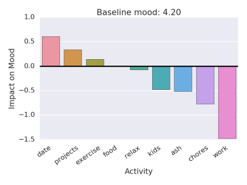

# Amygdala

Tool for integrating quantified self data

Goal is to predict mood given other attributes

- Time of day
- Day of week
- Hours of sleep
- Daily activities
- Previous moods (treat as time-series?)

Should I assume days have a markov property with respect to mood?

# Daylio

[Link](https://daylio.webflow.io/) to Daylio mood tracker

### Predicting mood from activities logged in Daylio

Need to export as csv to Google drive then download (there has to be a better way)

Daylio allows you to create and log your mood as 1 of 5 levels.  I am translating the moods to a scale from 1 to 5 and using the activities to predict mood.

So far this builds a linear model to predict mood score based on activities.  Below is a visualization of the coefficients for each activity.

# Fitbit

TODO - integrate Fitbit api and see how sleep and workouts impact mood

